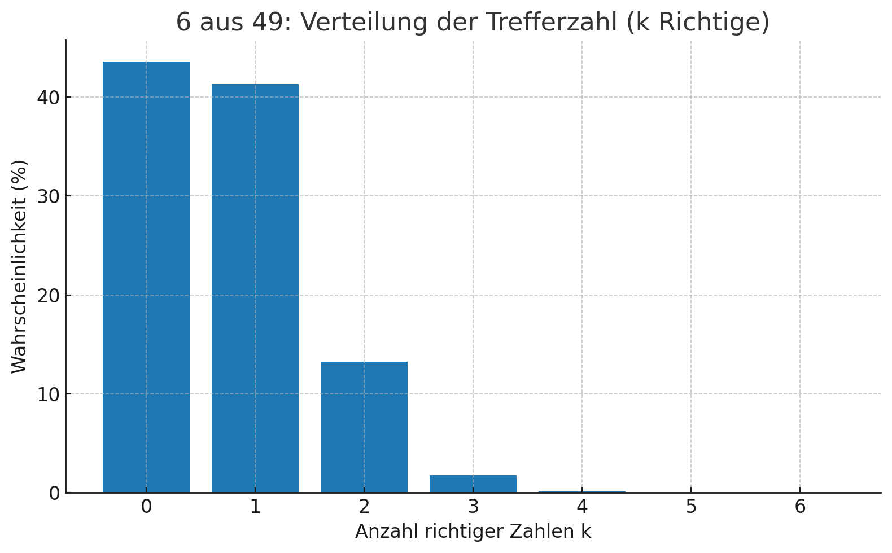
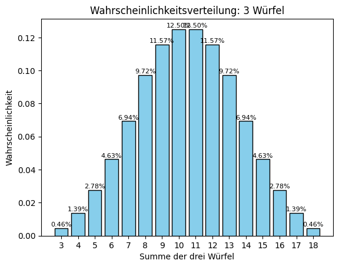

# Probability-calculus


[](https://github.com/LiBeKra/Probability-calculus/actions/workflows/pages/pages-build-deployment)

Leider erst in Klasse 9 kam die 9a32 dazu, das alte Thema der 7. Klasse zur Wahrscheinlichkeitsberechnung im Matheunterricht durchzunehmen. Dabei macht es so viel Spass!

Hier ein paar Hausaufgaben als Beispiele:

## 6 aus 49

> Schreibe ein Pythonprogramm um die Wahrscheinlichkeiten für 6 aus 49 auszurechnen.

``` py
import math

def comb(n, k):
    return math.comb(n, k)  # ab Python 3.8 verfügbar

def lotto_probabilities():
    total = comb(49, 6)  # alle möglichen Tipps
    probs = {}

    for k in range(7):  # 0 bis 6 Richtige
        # Anzahl der günstigen Fälle:
        # k Richtige aus den 6 gezogenen Zahlen, und (6-k) Falsche aus den 43 übrigen
        favorable = comb(6, k) * comb(49 - 6, 6 - k)
        probs[k] = favorable / total
    return probs

# Ausgabe
probs = lotto_probabilities()
print("Wahrscheinlichkeiten für 6 aus 49:\n")
for k, p in probs.items():
    print(f"{k} Richtige: {p:.10f} ({p*100:.8f}%)")
```

Und das Ergebnis ist:
```
Wahrscheinlichkeiten für 6 aus 49:

0 Richtige: 0.4359649755 (43.59649755%)
1 Richtige: 0.4130194505 (41.30194505%)
2 Richtige: 0.1323780290 (13.23780290%)
3 Richtige: 0.0176504039 (1.76504039%)
4 Richtige: 0.0009686197 (0.09686197%)
5 Richtige: 0.0000184499 (0.00184499%)
6 Richtige: 0.0000000715 (0.00000715%)
```



## Drei Würfel

Die minimale Augenzahl für drei Würfel ist 3, die maximale ist 18. Für beide Werte gibt es nur eine Möglichkeit. Wie sind aber die Wahrscheinlichkeiten der anderen Augenzahlen verteilt?

``` py
# Erzeugt mit ChatGPT 5
#
# Prompt: Create a column graph in text for the probability
# of the outcome of 3 dices in python

from collections import Counter
import itertools

# Calculate probabilities for 3 dice
dice = [1, 2, 3, 4, 5, 6]
sums = [sum(roll) for roll in itertools.product(dice, repeat=3)]
counts = Counter(sums)

# Normalize to probabilities
total = len(sums)
probs = {s: counts[s]/total for s in range(3, 19)}  # possible sums from 3 to 18

# Scale probabilities to fit column graph height
max_height = 20
scale = max_height / max(probs.values())

# Draw the column graph
print("Probability distribution of 3 dice (text column graph)\n")
for level in range(max_height, 0, -1):  # top to bottom
    line = ""
    for s in range(3, 19):
        if round(probs[s] * scale) >= level:
            line += "██ "   # block character for column
        else:
            line += "   "
    print(line)

# Print labels at the bottom
print(" ".join(f"{s:2}" for s in range(3, 19)))
```

Das Ergebnis:

``` sh
(v13) PS D:\github\LiBeKra\Probability-calculus\python> python .\zufall.py
Probability distribution of 3 dice (text column graph)

                     ██ ██
                  ██ ██ ██ ██
                  ██ ██ ██ ██
                  ██ ██ ██ ██
               ██ ██ ██ ██ ██ ██
               ██ ██ ██ ██ ██ ██
               ██ ██ ██ ██ ██ ██
               ██ ██ ██ ██ ██ ██
               ██ ██ ██ ██ ██ ██
            ██ ██ ██ ██ ██ ██ ██ ██
            ██ ██ ██ ██ ██ ██ ██ ██
            ██ ██ ██ ██ ██ ██ ██ ██
            ██ ██ ██ ██ ██ ██ ██ ██
         ██ ██ ██ ██ ██ ██ ██ ██ ██ ██
         ██ ██ ██ ██ ██ ██ ██ ██ ██ ██
         ██ ██ ██ ██ ██ ██ ██ ██ ██ ██
      ██ ██ ██ ██ ██ ██ ██ ██ ██ ██ ██ ██
      ██ ██ ██ ██ ██ ██ ██ ██ ██ ██ ██ ██
   ██ ██ ██ ██ ██ ██ ██ ██ ██ ██ ██ ██ ██ ██
██ ██ ██ ██ ██ ██ ██ ██ ██ ██ ██ ██ ██ ██ ██ ██
 3  4  5  6  7  8  9 10 11 12 13 14 15 16 17 18
```

Und das wird in Jupyter Notebook mit mathplotlib erzeugt:


